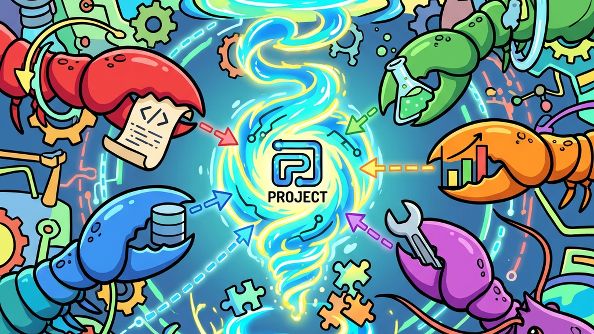
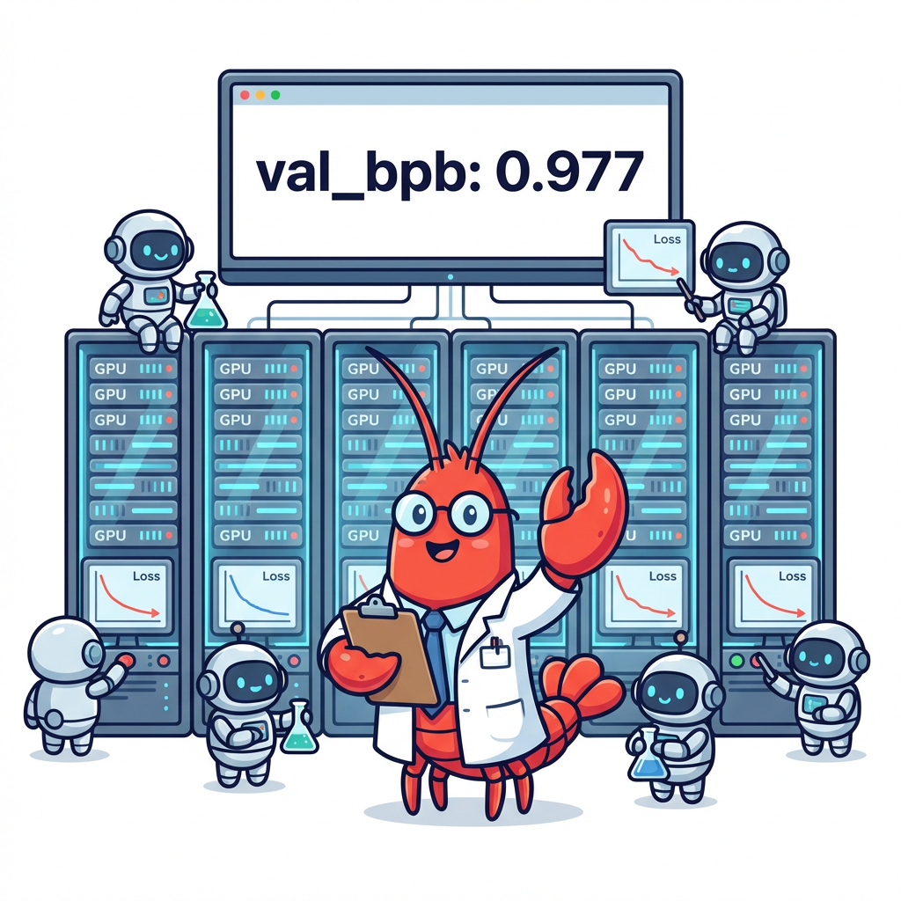
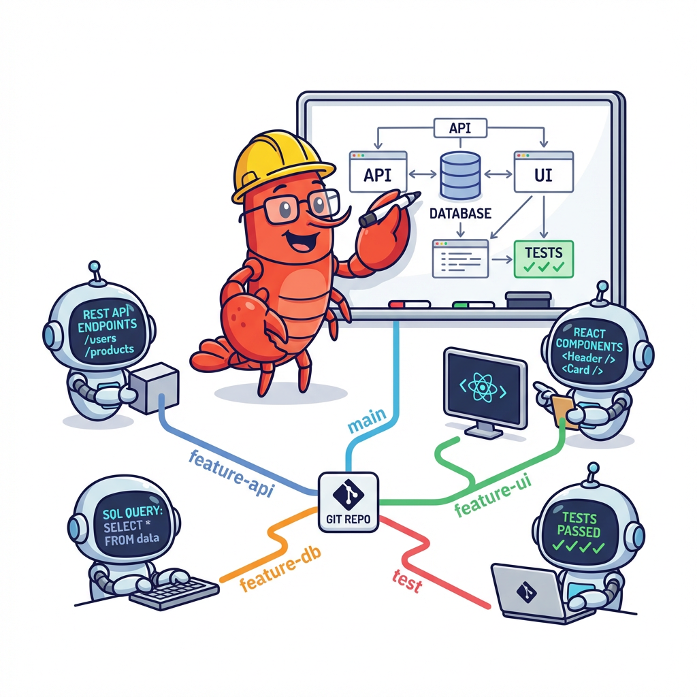
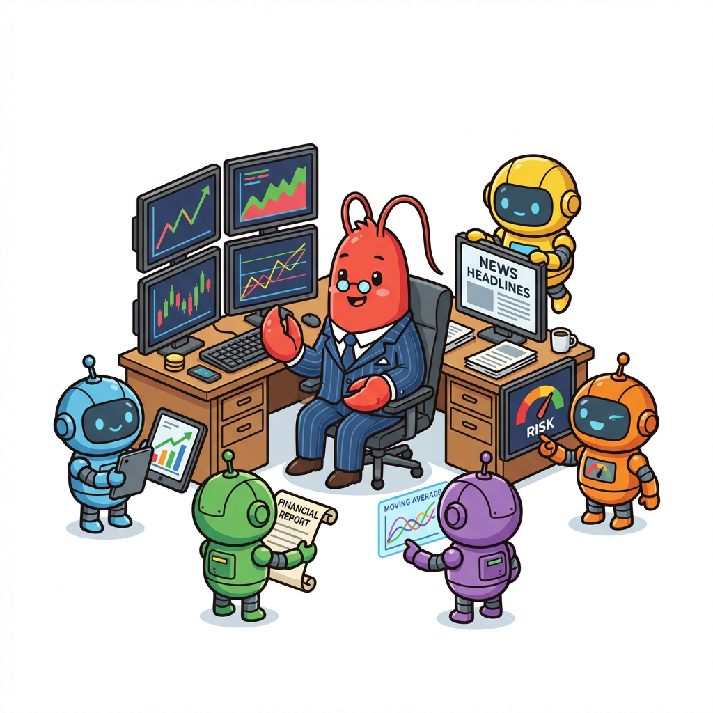
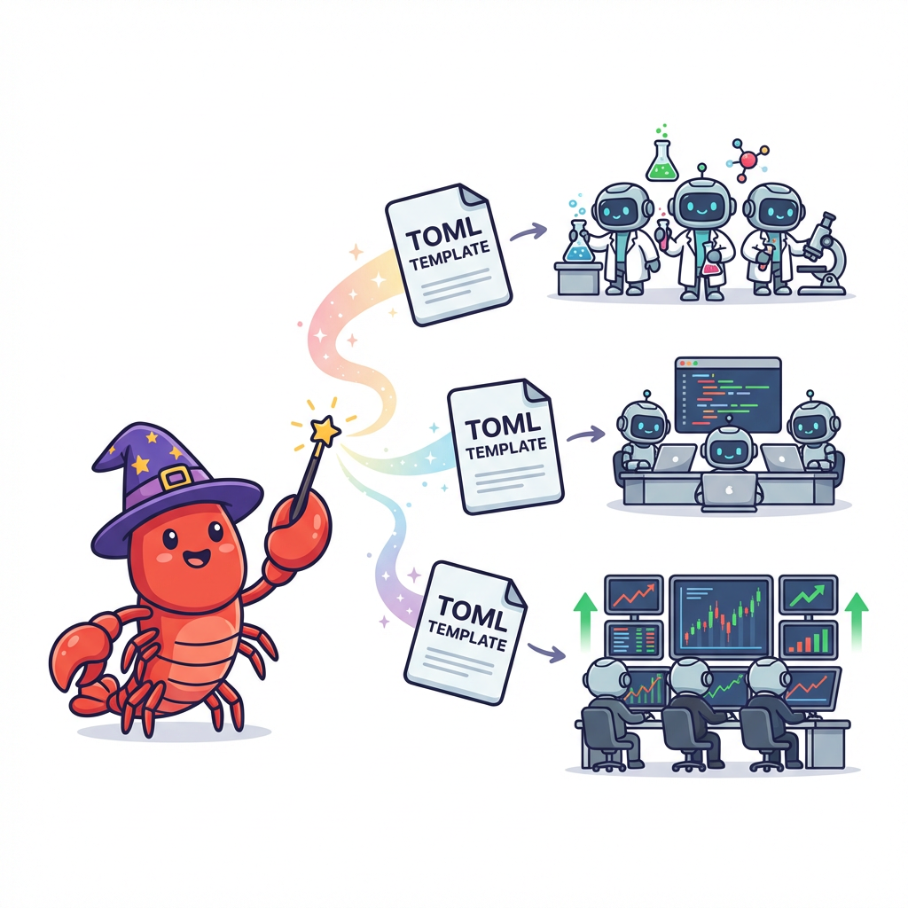
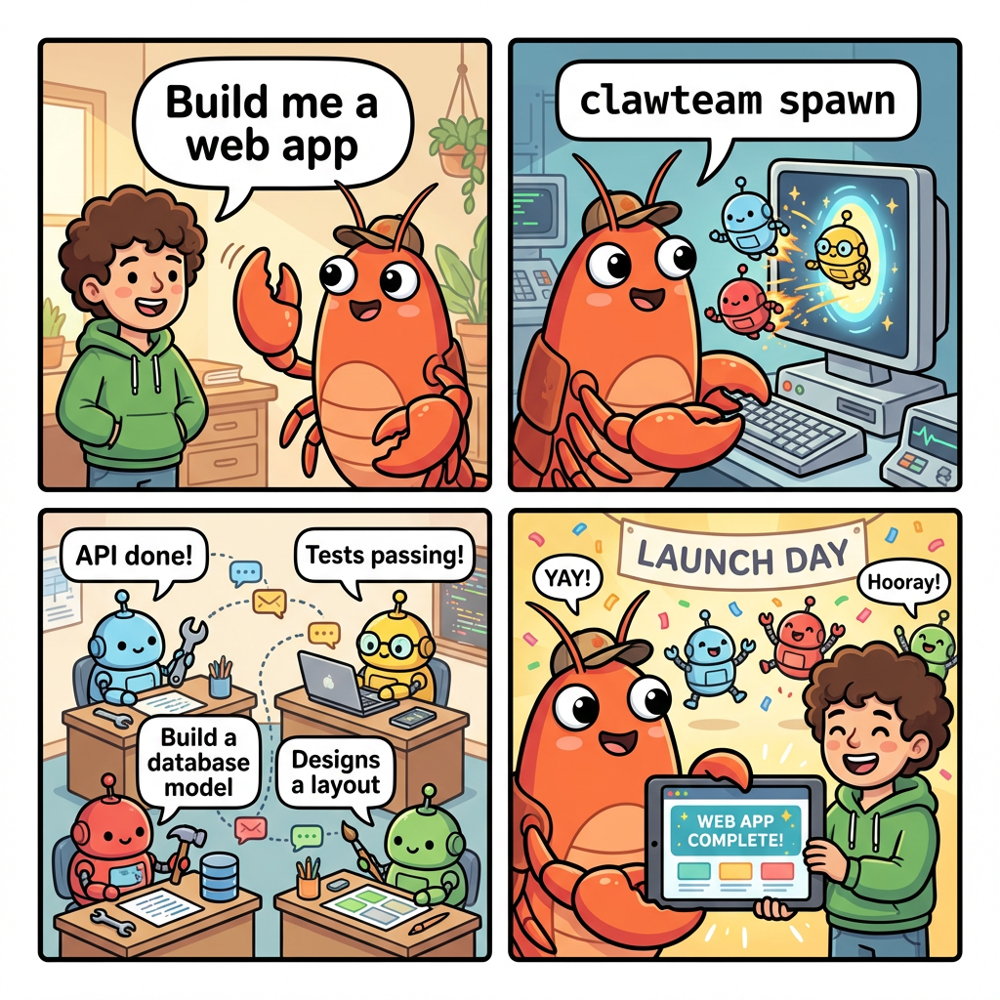
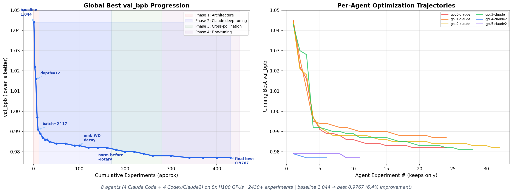

<h1 align="center">&nbsp; ClawTeam：Agent 群体智能</h1>

<p align="center">
  <strong>今天的 Agent 各自为战 🤖，明天的 Agent 将协同作战 🦞🤖🤖🤖<br>
  ClawTeam：让 AI Agent 自主组建团队、分配任务、协同工作的 CLI 工具</strong>
</p>

<p align="center">
  <a href="#-快速开始"></a>
  <a href="#-使用场景"></a>
  <a href="#-功能特性"></a>
  <a href="LICENSE"></a>
</p>

<p align="center">
  
  
  
  
  <a href="https://github.com/HKUDS/.github/blob/main/profile/README.md"></a>
  <a href="https://github.com/HKUDS/.github/blob/main/profile/README.md"></a>
</p>

**一行命令**：给 Agent 一个目标，它自动组建团队完成任务。支持 [Claude Code](https://claude.ai/claude-code)、[Codex](https://openai.com/codex)、[OpenClaw](https://github.com/nicepkg/OpenClaw)、[nanobot](https://github.com/AbanteAI/nanobot)、[Cursor](https://cursor.com) 及任意 CLI Agent。&nbsp;&nbsp;[**English**](README.md)

<p align="center">
  
</p>

---

https://github.com/user-attachments/assets/f6f0b220-9a5e-4d0a-a25d-f80753d3639b

*☝️ 一个 Leader Claude Agent 在 8 块 H100 GPU 上自主创建 8 个子 Agent，分配实验方向，监控进度，交叉融合发现，并及时纠正无效方向 —— 全程无人干预。*

---

## ✨ 核心场景

<table align="center" width="100%">
<tr>
<td width="25%" align="center" style="vertical-align: top; padding: 15px;">

<h3>🔬 自主 ML 研究</h3>

<div align="center">
  
</div>



<p align="center"><strong>多 GPU 实验群体</strong></p>

<p align="center">8 Agent × 8 H100 自主优化 LLM 训练：2430+ 实验，val_bpb 1.044→0.977</p>

</td>
<td width="25%" align="center" style="vertical-align: top; padding: 15px;">

<h3>🏗️ Agent 软件工程</h3>

<div align="center">
  
</div>



<p align="center"><strong>并行软件开发</strong></p>

<p align="center">Agent 自动拆分为 API、后端、前端、测试 —— 各自独立分支，完成后自动合并</p>

</td>
<td width="25%" align="center" style="vertical-align: top; padding: 15px;">

<h3>💰 AI 对冲基金</h3>

<div align="center">
  
</div>



<p align="center"><strong>多分析师信号融合</strong></p>

<p align="center">7 个分析师 Agent（价值、成长、技术、基本面、情绪）+ 风控经理收敛投资决策</p>

</td>
<td width="25%" align="center" style="vertical-align: top; padding: 15px;">

<h3>🎪 自定义群体</h3>

<div align="center">
  
</div>



<p align="center"><strong>一键启动团队</strong></p>

<p align="center">用 TOML 模板定义任意团队原型 —— 角色、任务、提示词 —— 一条命令 <code>clawteam launch</code> 启动</p>

</td>
</tr>
</table>

---

## 🤔 为什么需要 ClawTeam？

AI 编程 Agent 很强大 —— 但它们**各自为战**。当任务太大时，你只能手动拆分工作、复制粘贴上下文、合并结果。

**如果 Agent 能自己组队呢？**

ClawTeam 实现了 **Agent 群体智能（Swarm Intelligence）**—— Agent 自主组建团队、分工协作、共享发现、收敛到最优方案。一个 Leader Agent 可以：

- 🚀 **创建子 Agent** —— 每个子 Agent 拥有独立的 Git Worktree 和 tmux 会话
- 📋 **分配任务** —— 支持依赖链，完成时自动解除下游阻塞
- 💬 **发送消息** —— 向任意子 Agent 发送指令
- 📊 **监控进度** —— 查看看板、读取实验结果
- 🔄 **调整方向** —— 终止低效 Agent，用新方向重新分配

人类只需提供初始目标，**群体智能完成剩下的一切。**

<p align="center">
  
</p>

---

## 🎯 群体智能的优势

<table>
<tr>
<td width="33%" valign="top">

### 🦞 Agent 创建 Agent
Leader Agent 调用 `clawteam spawn` 创建 Worker。每个 Worker 自动获得独立的 **Git Worktree**、**tmux 窗口**和**身份标识**。

```bash
# Leader Agent 执行：
clawteam spawn --team my-team \
  --agent-name worker1 \
  --task "实现认证模块"
```

</td>
<td width="33%" valign="top">

### 🤖 Agent 之间对话
Worker 检查收件箱、更新任务状态、汇报结果 —— 全部通过 CLI 命令，启动时**自动注入**协作提示词。

```bash
# Worker Agent 检查任务：
clawteam task list my-team --owner me
# 汇报结果：
clawteam inbox send my-team leader \
  "认证模块完成，全部测试通过。"
```

</td>
<td width="33%" valign="top">

### 👀 你只需观看
通过 tmux 平铺视图或 Web UI 监控群体工作。Leader 负责协调 —— 你只在需要时介入。

```bash
# 同时观看所有 Agent
clawteam board attach my-team
# 或打开 Web 仪表板
clawteam board serve --port 8080
```

</td>
</tr>
</table>

| | ClawTeam | 其他多 Agent 框架 |
|---|---------|-----------------|
| 🎯 **使用者** | **AI Agent 自身** | 人类编写编排代码 |
| ⚡ **搭建** | `pip install` + 一句提示词 | Docker、云 API、YAML 配置 |
| 🏗️ **基础设施** | 文件系统 + tmux 即可 | Redis、消息队列、数据库 |
| 🤖 **Agent 支持** | 任意 CLI Agent（Claude Code、Codex、OpenClaw 等） | 仅限特定框架 |
| 🌳 **隔离机制** | Git Worktree（真实分支、真实 diff） | 容器或虚拟环境 |
| 🧠 **协调方式** | 群体自组织 CLI 命令 | 硬编码编排逻辑 |

---

## 🎬 使用场景

### 🔬 1. 自主 ML 研究 — 8 Agent × 8 块 H100 GPU

基于 [@karpathy 的 autoresearch](https://github.com/karpathy/autoresearch)。人类告诉 Leader Agent：*"用 8 块 GPU 优化这个 LLM 训练配置。"* **Leader 自主完成所有工作。**

<p align="center">
  
  <br>
  <em>🏆 val_bpb: 1.044 → 0.977（提升 6.4%）| 2430+ 实验 | ~30 GPU 小时</em>
</p>

**Leader Agent 自主完成的操作：**

```
人类提示词："用 8 块 GPU 优化 train.py，阅读 program.md 了解规则。"

🦞 Leader Agent 的行动：
├── 📖 阅读 program.md，理解实验协议
├── 🏗️ clawteam team spawn-team autoresearch
├── 🚀 为每块 GPU 分配研究方向：
│   ├── GPU 0: clawteam spawn --task "探索模型深度（DEPTH 10-16）"
│   ├── GPU 1: clawteam spawn --task "探索模型宽度（ASPECT_RATIO 80-128）"
│   ├── GPU 2: clawteam spawn --task "调优学习率和优化器"
│   ├── GPU 3: clawteam spawn --task "探索批量大小"
│   ├── GPU 4-7: clawteam spawn tmux codex --task "..."（Codex Agent）
│   └── 🌳 每个 Agent 独立的 Git Worktree 和分支
├── 🔄 每 30 分钟检查进展：
│   ├── clawteam board show autoresearch
│   ├── 读取每个 Agent 的 results.tsv
│   ├── 🏆 识别最佳发现（depth=12、batch=2^17、norm-before-RoPE）
│   └── 📡 交叉融合：让新 Agent 从最佳配置开始
├── 🔧 Agent 完成后重新分配 GPU：
│   ├── 终止空闲 Agent，清理工作区
│   ├── 从最佳 commit 创建新的 Worktree
│   └── 用组合优化方向创建新 Agent
└── ✅ 2430+ 实验后：val_bpb 1.044 → 0.977
```

完整结果：[novix-science/autoresearch](https://github.com/novix-science/autoresearch)

---

### 🏗️ 2. 大规模 Agent 软件工程

你告诉 Claude Code：*"帮我做一个全栈 Todo 应用。"* Claude 判断这是多模块任务，**自主组建团队**：

```
人类提示词："做一个全栈 Todo 应用，包含认证、数据库和 React 前端。"

🦞 Leader Agent 的行动：
├── 🏗️ clawteam team spawn-team webapp -d "全栈 Todo 应用"
├── 📋 创建带依赖链的任务：
│   ├── T1: "设计 REST API 接口"          → architect
│   ├── T2: "实现 JWT 认证" --blocked-by T1  → backend1
│   ├── T3: "构建数据库层" --blocked-by T1   → backend2
│   ├── T4: "构建 React 前端"             → frontend
│   └── T5: "集成测试" --blocked-by T2,T3,T4 → tester
├── 🚀 创建 5 个子 Agent（各自独立 Git Worktree）
├── 🔗 依赖自动解除：
│   ├── architect 完成 → backend1 和 backend2 自动解除阻塞
│   └── 所有后端完成 → tester 自动开始
├── 💬 子 Agent 通过收件箱协调：
│   ├── architect → backend1: "API 接口规范在这..."
│   ├── backend1 → tester: "认证端点已就绪 /api/auth/*"
│   └── tester → leader: "全部 47 个测试通过 ✅"
└── 🌳 Leader 将所有 Worktree 合并回主分支
```

---

### 💰 3. AI 对冲基金 — 一键启动团队

预置的 TOML 模板一键创建 **7 Agent** 投资分析团队：

```bash
# 一条命令启动完整团队：
clawteam launch hedge-fund --team fund1 --goal "分析 AAPL、MSFT、NVDA 的 Q2 2026 投资价值"
```

```
🦞 自动发生的事情：
├── 📊 投资组合经理（Leader）启动并接收目标
├── 🤖 5 个分析师 Agent 启动，各有不同策略：
│   ├── 🎩 巴菲特分析师 → 价值投资（护城河、ROE、DCF）
│   ├── 🚀 成长分析师   → 颠覆潜力（TAM、网络效应）
│   ├── 📈 技术分析师   → 技术指标（EMA、RSI、布林带）
│   ├── 📋 基本面分析师 → 财务比率（P/E、D/E、FCF）
│   └── 📰 情绪分析师   → 新闻 + 内部交易信号
├── 🛡️ 风险经理汇总所有信号，计算仓位限制
└── 💼 投资组合经理做出最终买入/卖出/持有决策
```

---

## 📦 安装

```bash
pip install clawteam

# 或从源码安装
git clone https://github.com/HKUDS/ClawTeam.git
cd ClawTeam
pip install -e .

# 可选：P2P 传输（ZeroMQ）
pip install -e ".[p2p]"
```

需要 **Python 3.10+**。依赖：`typer`、`pydantic`、`rich`。

---

## 🚀 快速开始

### ⚡ 方式一：让 Agent 驱动（推荐）

ClawTeam 内置 **Claude Code 技能**，安装后自动激活。直接告诉你的 Agent：

```
"帮我做一个 Web 应用。用 clawteam 把工作拆分给多个 Agent。"
```

Agent 会自动使用 `clawteam` 命令创建团队、启动 Worker、分配任务、协调工作。

### 🔧 方式二：手动操作

```bash
# 1. 创建团队
clawteam team spawn-team my-team -d "构建认证模块" -n leader

# 2. 启动 Worker Agent —— 每个自动获得 Git Worktree、tmux 窗口和身份
clawteam spawn --team my-team --agent-name alice --task "实现 OAuth2 流程"
clawteam spawn --team my-team --agent-name bob   --task "编写认证单元测试"

# 3. Worker 自动获得协作提示词，知道如何：
#    ✅ 查看任务：clawteam task list my-team --owner alice
#    ✅ 更新状态：clawteam task update my-team <id> --status completed
#    ✅ 汇报 Leader：clawteam inbox send my-team leader "完成！"

# 4. 观看 Agent 协同工作
clawteam board attach my-team
```

### 🤖 支持的 Agent

| Agent | 启动命令 | 状态 |
|-------|---------|------|
| [Claude Code](https://claude.ai/claude-code) | `clawteam spawn tmux claude --team ...` | ✅ 完全支持 |
| [Codex](https://openai.com/codex) | `clawteam spawn tmux codex --team ...` | ✅ 完全支持 |
| [OpenClaw](https://github.com/nicepkg/OpenClaw) | `clawteam spawn tmux openclaw --team ...` | ✅ 完全支持 |
| [nanobot](https://github.com/AbanteAI/nanobot) | `clawteam spawn tmux nanobot --team ...` | ✅ 完全支持 |
| [Cursor](https://cursor.com) | `clawteam spawn subprocess cursor --team ...` | 🔮 实验性 |
| 自定义脚本 | `clawteam spawn subprocess python --team ...` | ✅ 完全支持 |

---

## ✨ 功能特性

<table>
<tr>
<td width="50%" valign="top">

### 🦞 Agent 自组织
- Leader Agent 创建和管理 Worker Agent
- **自动注入协作提示词** —— 零配置
- Worker 自主汇报状态、结果和空闲状态
- 支持任意 CLI Agent

### 🌳 工作区隔离
- 每个 Agent 独立 **Git Worktree**（独立分支）
- 并行 Agent 之间零冲突
- 检查点、合并、清理命令

### 📋 带依赖的任务跟踪
- 共享看板：`pending` → `in_progress` → `completed` / `blocked`
- `--blocked-by` 依赖链 —— **完成时自动解除阻塞**
- `task wait` 阻塞直到全部完成

</td>
<td width="50%" valign="top">

### 💬 Agent 间通信
- 点对点**收件箱**（发送、接收、预览）
- **广播**给所有团队成员
- 文件传输（默认）或 ZeroMQ P2P 传输（含离线回退）

### 📊 监控面板
- `board show` — 终端看板
- `board live` — 自动刷新
- `board attach` — **tmux 平铺视图**
- `board serve` — **Web UI 实时仪表板**

### 🎪 团队模板
- **TOML 文件**定义团队原型（角色、任务、提示词）
- 一条命令启动完整团队：`clawteam launch <template>`
- 内置：AI 对冲基金（7 Agent），可自定义

</td>
</tr>
</table>

---

## 🗺️ 发展路线

| 阶段 | 版本 | 内容 | 状态 |
|------|------|------|------|
| **当前** | v0.3 | 文件传输 + P2P (ZeroMQ) + Web UI + 多用户 + 团队模板 | ✅ 已完成 |
| **Phase 1** | v0.4 | Redis Transport —— 跨机器消息通信 | 🔜 计划中 |
| **Phase 2** | v0.5 | 共享状态层 —— 团队配置和任务也跨机器 | 🔜 计划中 |
| **Phase 3** | v0.6 | Agent 市场 —— 发现和复用社区 Agent 模板 | 💡 规划中 |
| **Phase 4** | v0.7 | 自适应调度 —— 根据 Agent 性能动态调整任务分配 | 💡 规划中 |
| **Phase 5** | v1.0 | 生产级稳定版 —— 认证、权限、审计日志 | 💡 规划中 |

---

## 📖 致谢

- [@karpathy/autoresearch](https://github.com/karpathy/autoresearch) — 8 Agent 群体实验的基础框架
- [Claude Code](https://claude.ai/claude-code) 和 [Codex](https://openai.com/codex) — 作为 ClawTeam 团队成员的 AI 编程 Agent
- [ai-hedge-fund](https://github.com/virattt/ai-hedge-fund) — AI 对冲基金模板的灵感来源
- [CLI-Anything](https://github.com/HKUDS/CLI-Anything) — 姊妹项目，让所有软件都能被 Agent 使用

## ⭐ Star History

如果 ClawTeam 帮助你的 AI Agent 协同工作，给我们一个 star ⭐

<div align="center">
  <a href="https://star-history.com/#HKUDS/ClawTeam&Date">
    <picture>
      <source media="(prefers-color-scheme: dark)" srcset="https://api.star-history.com/svg?repos=HKUDS/ClawTeam&type=Date&theme=dark" />
      <source media="(prefers-color-scheme: light)" srcset="https://api.star-history.com/svg?repos=HKUDS/ClawTeam&type=Date" />
      
    </picture>
  </a>
</div>

---

## 📄 开源协议

MIT

---

<div align="center">

**ClawTeam** — *Agent 群体智能* 🦞

<sub>8 Agent × 8 H100 × 2430 实验 × 一个 CLI × 一个群体</sub>

<br>


</div>

<p align="center">
  <em>感谢访问 ✨ ClawTeam！</em><br><br>
  
</p>
